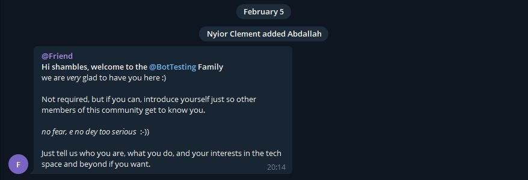

<h1 align="center">
	telegram-welcome-bot
</h1>

    

        <i>
            a bot that displays a nicely formatted welcome message to 
            new users added to a telegram group as seen in the image below
        </i>
    

    
    

        <i>
            note that, the "@BotTesting" group name will be 
            automatically replaced by the group name you've added
            the bot to.
        </i>
    

## Rationale

Do you want to be typing that redundant welcome message 
each time a new user joins your telegram group ?
I bet you don't! This bot saves you the time and stress of having 
to do that. It watches for when new members are added to 
a telgram group and it automatically shows them a welcome message.

## oh okay I gerrit. So how do I add this bot to my telegram group

* first of all, navigate to your telegram app search field and search for @DaigonBot, and a bot with the display name @friend and the username @DaigonBot should appear. 

* tap on the bot's name. You should be taken to a chat window where you could have convos with the bot

* tap on the bot's name again to view its details. You should then see a screen like the one below

## Contributing
Pull requests are welcome. For major changes, please open an issue first to discuss what you would like to change.

## License
[MIT](https://choosealicense.com/licenses/mit/)
